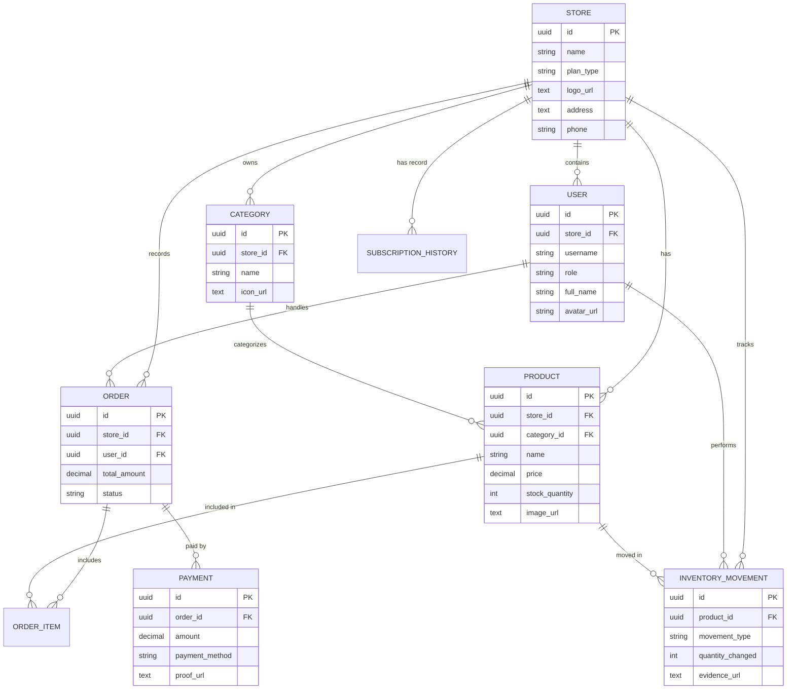

# 🏪 CorePOS — Point of Sale API

A modern POS (Point of Sale) system for retail stores, built with **Hexagonal Architecture** in Go.

## 🏗️ Tech Stack

| Technology | Purpose |
|---|---|
| **Go + Gin** | Web Framework |
| **GORM** | ORM for PostgreSQL |
| **PostgreSQL** | Primary Database |
| **MinIO** | Object Storage (images) |
| **UUID** | Primary Keys for all tables |
| **Docker Compose** | Infrastructure Setup |

## 📂 Project Structure

```
CorePOS/
├── cmd/api/
│   └── main.go              ← Entry point
├── config/
│   ├── config.go            ← Load env configuration
│   ├── database.go          ← DB connection
│   └── minio.go             ← MinIO connection
├── internal/
│   ├── core/
│   │   ├── domain/          ← Data models (Store, Product, Order, etc.)
│   │   └── ports/           ← Interfaces (Repository, Service)
│   ├── adapters/
│   │   ├── handlers/        ← HTTP handlers (Gin)
│   │   ├── repositories/    ← GORM implementations
│   │   └── middleware/       ← Logger, CORS, Security, Compression
│   └── services/            ← Business logic
├── pkg/
│   └── response.go          ← API response helpers
├── bruno/core pos/           ← Bruno API collection
├── docker-compose.yml
├── .env
└── go.mod
```

## 🚀 Getting Started

### 1. Start Infrastructure

```bash
docker-compose up -d
```

### 2. Configure Environment

Create a `.env` file:

```env
DB_HOST=localhost
DB_PORT=5432
DB_USER=postgres
DB_PASSWORD=postgres
DB_NAME=corepos
APP_PORT=8080

MINIO_ENDPOINT=localhost:9000
MINIO_ACCESS_KEY=minioadmin
MINIO_SECRET_KEY=minioadmin
```

### 3. Run Application

```bash
go run cmd/api/main.go
```

### 4. Run Tests

```bash
# Run all tests
go test ./... -v

# Run specific handler tests
go test ./internal/adapters/handlers/ -v

# Run with coverage
go test ./... -cover
```

## 🗺️ Database Schema (ERD)



## 📡 API Endpoints

### Auth
| Method | Path | Description |
|---|---|---|
| `POST` | `/api/v1/auth/register` | Register a new user |
| `POST` | `/api/v1/auth/login` | Login and get JWT |

### Stores
| Method | Path | Description |
|---|---|---|
| `POST` | `/api/v1/stores` | Create a Store |
| `GET` | `/api/v1/stores` | List all Stores |
| `POST` | `/api/v1/stores/:storeId/upload` | Upload image (avatar/logo/product) |

### Products (Store-scoped)
| Method | Path | Description |
|---|---|---|
| `GET` | `/api/v1/stores/:storeId/products` | List all Products |
| `GET` | `/api/v1/stores/:storeId/products/:id` | Get a Product by ID |
| `POST` | `/api/v1/stores/:storeId/products` | Create a Product |
| `PUT` | `/api/v1/stores/:storeId/products/:id` | Update a Product |
| `DELETE` | `/api/v1/stores/:storeId/products/:id` | Delete a Product |

### Categories (Store-scoped)
| Method | Path | Description |
|---|---|---|
| `GET` | `/api/v1/stores/:storeId/categories` | List all Categories |
| `GET` | `/api/v1/stores/:storeId/categories/:id` | Get a Category by ID |
| `POST` | `/api/v1/stores/:storeId/categories` | Create a Category |
| `PUT` | `/api/v1/stores/:storeId/categories/:id` | Update a Category |
| `DELETE` | `/api/v1/stores/:storeId/categories/:id` | Delete a Category |

### Orders (Store-scoped)
| Method | Path | Description |
|---|---|---|
| `GET` | `/api/v1/stores/:storeId/orders` | List all Orders |
| `GET` | `/api/v1/stores/:storeId/orders/:id` | Get an Order by ID |
| `POST` | `/api/v1/stores/:storeId/orders` | Create an Order (Transaction) |
| `PATCH` | `/api/v1/stores/:storeId/orders/:id/void` | Void an Order |

## 🧪 Testing with Bruno

1. Open the **Bruno** app
2. **Open Collection** → select `bruno/core pos/`
3. Select Environment → **Local**
4. Test flow:
   - `Create Store` → copy returned UUID to environment `storeId`
   - `Register User` → create credentials
   - `Login` → copy returned `token` to environment `token`
   - Now you can test all protected routes (Products, Categories, Orders)

## 🛡️ Middleware

| Middleware | Purpose |
|---|---|
| **RequestID** | Unique UUID per request for tracing |
| **Logger** | Formatted logs with method, path, body, reqID |
| **Recovery** | Catches panics to prevent server crashes |
| **CORS** | Cross-Origin Resource Sharing support |
| **Security** | Headers to prevent XSS, Clickjacking, MIME sniffing |
| **Compression** | Gzip response compression |
| **Auth (JWT)** | Protects routes using Bearer token |

## 🔷 Architecture

```
HTTP Request → Handler → Service → Repository → PostgreSQL
                 ↑            ↑           ↑
              (Adapter)   (Core)     (Adapter)

All layers communicate through Interfaces (Ports).
Swap DB or Framework without affecting Business Logic.
```