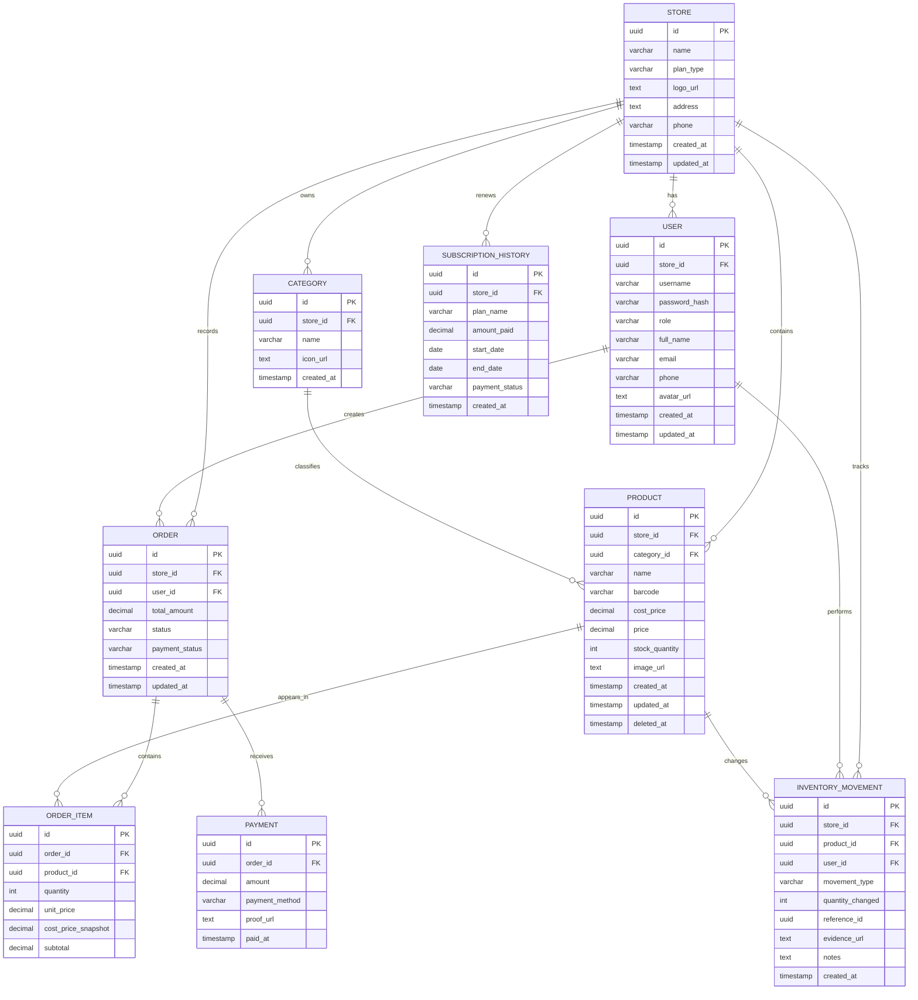

# CorePOS

CorePOS is a Point of Sale API built with Go, Gin, GORM, PostgreSQL, and MinIO. The project follows a hexagonal structure so handlers, services, repositories, and domain models stay separated and easier to extend.

## Tech Stack

| Technology | Purpose |
|---|---|
| Go + Gin | REST API |
| GORM | ORM |
| PostgreSQL | Primary database |
| MinIO | Object storage for images |
| UUID | Primary keys |
| Docker Compose | Local infrastructure |

## Project Structure

```text
CorePOS/
├── cmd/api/main.go
├── config/
├── internal/
│   ├── adapters/
│   │   ├── handlers/
│   │   ├── middleware/
│   │   └── repositories/
│   ├── core/
│   │   ├── domain/
│   │   └── ports/
│   └── services/
├── pkg/
├── bruno/
└── docker-compose.yml
```

## Getting Started

### 1. Start infrastructure

```bash
docker-compose up -d
```

### 2. Configure `.env`

```env
DB_HOST=localhost
DB_PORT=5432
DB_USER=postgres
DB_PASSWORD=postgres
DB_NAME=corepos
APP_PORT=8080

MINIO_ENDPOINT=localhost:9000
MINIO_ACCESS_KEY=minioadmin
MINIO_SECRET_KEY=minioadmin
```

### 3. Run the API

```bash
go run cmd/api/main.go
```

### 4. Run tests

```bash
go test ./...
```

## Current API Routes

The routes below are the ones actually registered in [main.go](/D:/Tutorial/CorePOS/cmd/api/main.go).

### Health

| Method | Path | Description |
|---|---|---|
| `GET` | `/health` | Health check |

### Store

| Method | Path | Description |
|---|---|---|
| `POST` | `/api/v1/stores` | Create a store |
| `GET` | `/api/v1/stores` | List stores |

### Auth

| Method | Path | Description |
|---|---|---|
| `POST` | `/api/v1/auth/register` | Register a user |
| `POST` | `/api/v1/auth/login` | Login and receive access and refresh tokens |
| `POST` | `/api/v1/auth/refresh` | Refresh tokens |
| `POST` | `/api/v1/auth/logout` | Stateless logout |

### Product

| Method | Path | Description |
|---|---|---|
| `GET` | `/api/v1/stores/:storeId/products` | List store products |
| `GET` | `/api/v1/stores/:storeId/products/:id` | Get one product |
| `POST` | `/api/v1/stores/:storeId/products` | Create a product |
| `PUT` | `/api/v1/stores/:storeId/products/:id` | Update a product |
| `DELETE` | `/api/v1/stores/:storeId/products/:id` | Delete a product |

## Services

Service interfaces are defined in [services.go](/D:/Tutorial/CorePOS/internal/core/ports/services.go).

| Service | File | Status | Responsibility |
|---|---|---|---|
| AuthService | [auth_service.go](/D:/Tutorial/CorePOS/internal/services/auth_service.go) | Implemented | Register, login, refresh token, logout |
| ProductService | [product_service.go](/D:/Tutorial/CorePOS/internal/services/product_service.go) | Implemented | Product CRUD |
| InventoryService | [inventory_service.go](/D:/Tutorial/CorePOS/internal/services/inventory_service.go) | Partial | Constructor exists, business logic is not implemented yet |
| CategoryService | [category_service.go](/D:/Tutorial/CorePOS/internal/services/category_service.go) | Stub | Not implemented |
| OrderService | [order_service.go](/D:/Tutorial/CorePOS/internal/services/order_service.go) | Stub | Not implemented |

## Request Flow

### Product flow

```text
Client
-> Gin Handler
-> ProductService
-> ProductRepository
-> PostgreSQL
-> JSON Response
```

1. The client calls a route under `/api/v1/stores/:storeId/products`.
2. `ProductHandler` parses path params and request payload.
3. `ProductService` handles service-layer logic.
4. `ProductRepository` persists and reads data through GORM.
5. The response is returned through `pkg.Success()` or `pkg.Error()`.

### Auth flow

```text
Client
-> AuthHandler
-> AuthService
-> UserRepository
-> PostgreSQL
-> JWT Access Token / Refresh Token
```

1. `register` accepts user data and an optional avatar file.
2. If an avatar is included, the file is uploaded to MinIO.
3. `AuthService.Register()` hashes the password with bcrypt.
4. `UserRepository` stores the user in PostgreSQL.
5. `login` verifies username and password.
6. On success, the service returns JWT access and refresh tokens.

### Middleware flow

The following middleware is actively applied in [main.go](/D:/Tutorial/CorePOS/cmd/api/main.go):

1. RequestID
2. Logger
3. Recovery
4. CORS
5. Security
6. Compression

Note: JWT auth middleware exists in the project, but it is not currently attached to protected routes in `main.go`.

## ERD

The domain layer models the following entity relationships.


```mermaid
erDiagram
    STORE ||--o{ USER : has
    STORE ||--o{ CATEGORY : owns
    STORE ||--o{ PRODUCT : contains
    STORE ||--o{ ORDER : records
    STORE ||--o{ INVENTORY_MOVEMENT : tracks
    STORE ||--o{ SUBSCRIPTION_HISTORY : renews
    CATEGORY ||--o{ PRODUCT : classifies
    USER ||--o{ ORDER : creates
    USER ||--o{ INVENTORY_MOVEMENT : performs
    ORDER ||--o{ ORDER_ITEM : contains
    ORDER ||--o{ PAYMENT : receives
    PRODUCT ||--o{ ORDER_ITEM : appears_in
    PRODUCT ||--o{ INVENTORY_MOVEMENT : changes

    STORE {
        uuid id PK
        varchar name
        varchar plan_type
        text logo_url
        text address
        varchar phone
        timestamp created_at
        timestamp updated_at
    }

    USER {
        uuid id PK
        uuid store_id FK
        varchar username
        varchar password_hash
        varchar role
        varchar full_name
        varchar email
        varchar phone
        text avatar_url
        timestamp created_at
        timestamp updated_at
    }

    CATEGORY {
        uuid id PK
        uuid store_id FK
        varchar name
        text icon_url
        timestamp created_at
    }

    PRODUCT {
        uuid id PK
        uuid store_id FK
        uuid category_id FK
        varchar name
        varchar barcode
        decimal cost_price
        decimal price
        int stock_quantity
        text image_url
        timestamp created_at
        timestamp updated_at
        timestamp deleted_at
    }

    ORDER {
        uuid id PK
        uuid store_id FK
        uuid user_id FK
        decimal total_amount
        varchar status
        varchar payment_status
        timestamp created_at
        timestamp updated_at
    }

    ORDER_ITEM {
        uuid id PK
        uuid order_id FK
        uuid product_id FK
        int quantity
        decimal unit_price
        decimal cost_price_snapshot
        decimal subtotal
    }

    PAYMENT {
        uuid id PK
        uuid order_id FK
        decimal amount
        varchar payment_method
        text proof_url
        timestamp paid_at
    }

    INVENTORY_MOVEMENT {
        uuid id PK
        uuid store_id FK
        uuid product_id FK
        uuid user_id FK
        varchar movement_type
        int quantity_changed
        uuid reference_id
        text evidence_url
        text notes
        timestamp created_at
    }

    SUBSCRIPTION_HISTORY {
        uuid id PK
        uuid store_id FK
        varchar plan_name
        decimal amount_paid
        date start_date
        date end_date
        varchar payment_status
        timestamp created_at
    }
```

## SQL Schema Summary

The SQL below is derived from the domain models in `internal/core/domain`.

```sql
CREATE TABLE stores (
    id UUID PRIMARY KEY,
    name VARCHAR(255) NOT NULL,
    plan_type VARCHAR(50) DEFAULT 'free',
    logo_url TEXT,
    address TEXT,
    phone VARCHAR(20),
    created_at TIMESTAMP,
    updated_at TIMESTAMP
);

CREATE TABLE users (
    id UUID PRIMARY KEY,
    store_id UUID NOT NULL REFERENCES stores(id) ON DELETE CASCADE,
    username VARCHAR(100) NOT NULL UNIQUE,
    password_hash VARCHAR(255) NOT NULL,
    role VARCHAR(50) DEFAULT 'cashier',
    full_name VARCHAR(255),
    email VARCHAR(255),
    phone VARCHAR(20),
    avatar_url TEXT,
    created_at TIMESTAMP,
    updated_at TIMESTAMP
);

CREATE TABLE categories (
    id UUID PRIMARY KEY,
    store_id UUID NOT NULL REFERENCES stores(id) ON DELETE CASCADE,
    name VARCHAR(100) NOT NULL,
    icon_url TEXT,
    created_at TIMESTAMP
);

CREATE TABLE products (
    id UUID PRIMARY KEY,
    store_id UUID NOT NULL REFERENCES stores(id) ON DELETE CASCADE,
    category_id UUID NULL REFERENCES categories(id) ON DELETE SET NULL,
    name VARCHAR(255) NOT NULL,
    barcode VARCHAR(100),
    cost_price DECIMAL(10,2) DEFAULT 0.00,
    price DECIMAL(10,2) NOT NULL,
    stock_quantity INTEGER DEFAULT 0,
    image_url TEXT,
    created_at TIMESTAMP,
    updated_at TIMESTAMP,
    deleted_at TIMESTAMP NULL
);

CREATE TABLE orders (
    id UUID PRIMARY KEY,
    store_id UUID NOT NULL REFERENCES stores(id) ON DELETE CASCADE,
    user_id UUID NOT NULL REFERENCES users(id),
    total_amount DECIMAL(10,2) NOT NULL,
    status VARCHAR(20) DEFAULT 'completed',
    payment_status VARCHAR(20) DEFAULT 'unpaid',
    created_at TIMESTAMP,
    updated_at TIMESTAMP
);

CREATE TABLE order_items (
    id UUID PRIMARY KEY,
    order_id UUID NOT NULL REFERENCES orders(id),
    product_id UUID NULL REFERENCES products(id) ON DELETE SET NULL,
    quantity INTEGER NOT NULL,
    unit_price DECIMAL(10,2) NOT NULL,
    cost_price_snapshot DECIMAL(10,2) NOT NULL,
    subtotal DECIMAL(10,2) NOT NULL
);

CREATE TABLE payments (
    id UUID PRIMARY KEY,
    order_id UUID NOT NULL REFERENCES orders(id),
    amount DECIMAL(10,2) NOT NULL,
    payment_method VARCHAR(50) NOT NULL,
    proof_url TEXT,
    paid_at TIMESTAMP
);

CREATE TABLE inventory_movements (
    id UUID PRIMARY KEY,
    store_id UUID NOT NULL REFERENCES stores(id) ON DELETE CASCADE,
    product_id UUID NOT NULL REFERENCES products(id) ON DELETE CASCADE,
    user_id UUID NULL REFERENCES users(id) ON DELETE SET NULL,
    movement_type VARCHAR(50) NOT NULL,
    quantity_changed INTEGER NOT NULL,
    reference_id UUID NULL,
    evidence_url TEXT,
    notes TEXT,
    created_at TIMESTAMP
);

CREATE TABLE subscription_histories (
    id UUID PRIMARY KEY,
    store_id UUID NOT NULL REFERENCES stores(id) ON DELETE CASCADE,
    plan_name VARCHAR(50) NOT NULL,
    amount_paid DECIMAL(10,2) NOT NULL,
    start_date DATE NOT NULL,
    end_date DATE NOT NULL,
    payment_status VARCHAR(50) DEFAULT 'success',
    created_at TIMESTAMP
);
```

## AutoMigrate Status

The current `AutoMigrate` call in [main.go](/D:/Tutorial/CorePOS/cmd/api/main.go) only migrates these tables:

1. `stores`
2. `users`
3. `categories`
4. `products`

That means `orders`, `order_items`, `payments`, `inventory_movements`, and `subscription_histories` exist in the domain model but are not migrated at application startup yet.

## Current Project Status

Implemented and usable now:

1. Store routes
2. Auth routes
3. Product routes
4. Base middleware stack
5. Avatar upload during registration

Not complete yet:

1. Category service and routes are not implemented
2. Order service and routes are not implemented
3. Inventory service logic is incomplete
4. Upload route mentioned in older README content is not registered in `main.go`
5. JWT auth middleware is not enforced on protected routes

## Verification

The project currently passes:

```bash
go test ./...
```
